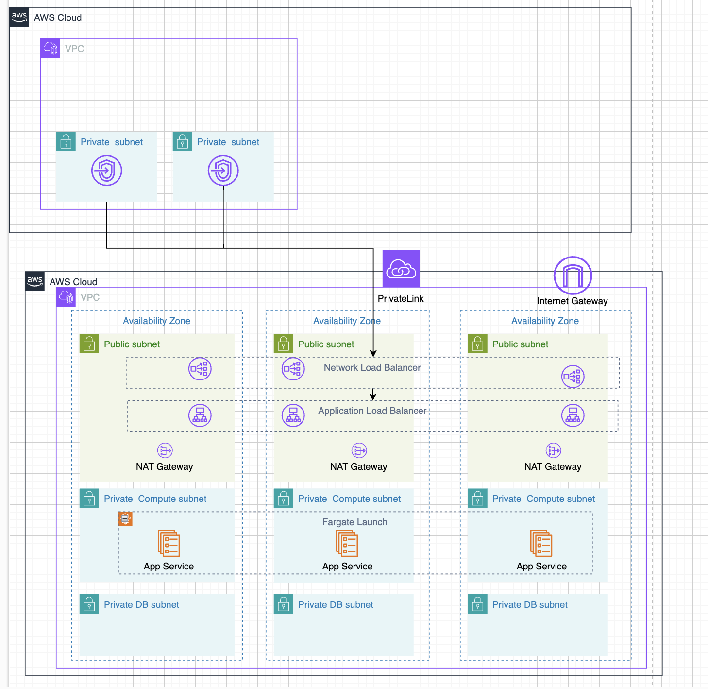

# private-saas-with-aws-privatelink-vpn
This repository is the example for network infrastructure of connection between medical facilities and AWS environment.

## Architecture




## Note 
下記のように環境変数を設定しないと、M1 Mac などでは動かなかった。（private-saas 配下）
```sh
export GODEBUG=asyncpreemptoff=1;
```


https での通信をしたいので、ドメインを事前に購入する必要あり。（本当に？）  
external ALB の場合は事前に必要なので、private ALB の場合は事前に必要なのかは不明。  


CloudShell で疎通確認をした。  


https://docs.aws.amazon.com/vpc/latest/privatelink/manage-dns-names.html

DNS の検証名は上記の手順で追加した。  